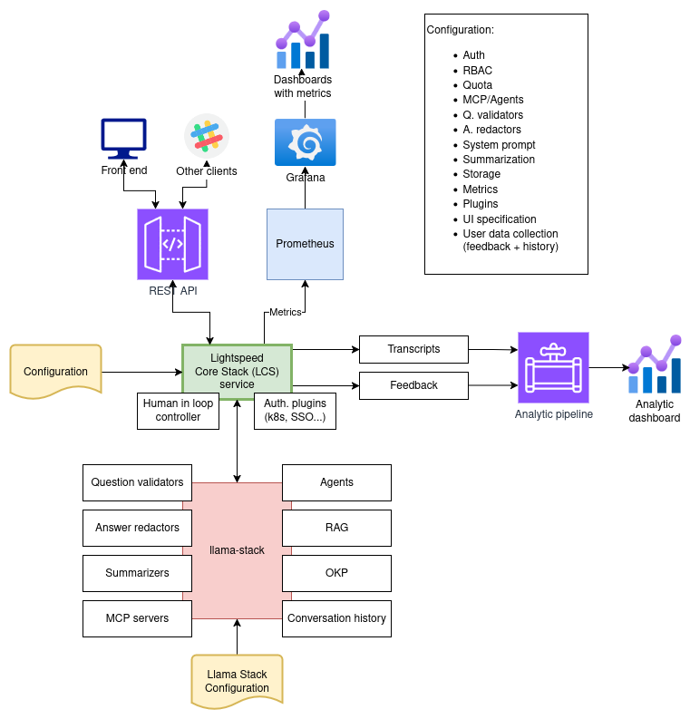
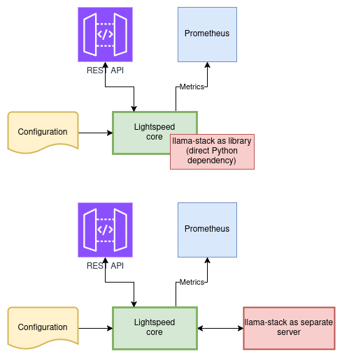
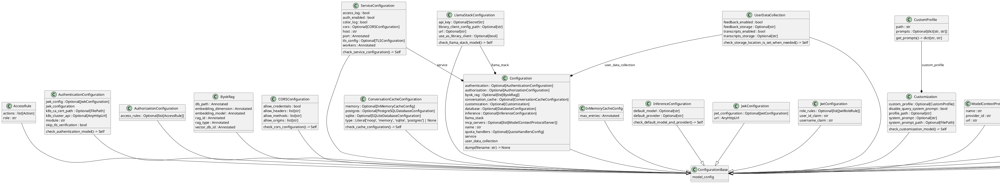
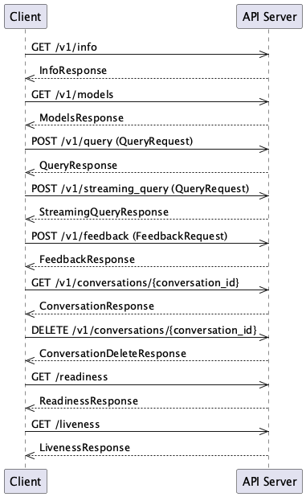

# lightspeed-stack

## About The Project

[](https://lightspeed-core.github.io/lightspeed-stack/)
[](https://github.com/lightspeed-core/lightspeed-stack/blob/main/LICENSE)
[](https://www.python.org/)
[](https://www.python.org/)
[](https://github.com/lightspeed-core/lightspeed-stack/releases/tag/0.1.3)

Lightspeed Core Stack (LCS) is an AI-powered assistant that provides answers to product questions using backend LLM services, agents, and RAG databases.


<!-- vim-markdown-toc GFM -->

* [Architecture](#architecture)
* [Prerequisites](#prerequisites)
* [Installation](#installation)
* [Configuration](#configuration)
    * [Integration with Llama Stack](#integration-with-llama-stack)
    * [Llama Stack as separate server](#llama-stack-as-separate-server)
        * [Llama Stack project and configuration](#llama-stack-project-and-configuration)
        * [Check connection to Llama Stack](#check-connection-to-llama-stack)
    * [Llama Stack as client library](#llama-stack-as-client-library)
    * [System prompt](#system-prompt)
    * [Safety Shields](#safety-shields)
* [Usage](#usage)
    * [Make targets](#make-targets)
    * [Running Linux container image](#running-linux-container-image)
* [Endpoints](#endpoints)
    * [OpenAPI specification](#openapi-specification)
    * [Readiness Endpoint](#readiness-endpoint)
    * [Liveness Endpoint](#liveness-endpoint)
* [Publish the service as Python package on PyPI](#publish-the-service-as-python-package-on-pypi)
    * [Generate distribution archives to be uploaded into Python registry](#generate-distribution-archives-to-be-uploaded-into-python-registry)
    * [Upload distribution archives into selected Python registry](#upload-distribution-archives-into-selected-python-registry)
    * [Packages on PyPI and Test PyPI](#packages-on-pypi-and-test-pypi)
* [Contributing](#contributing)
* [Testing](#testing)
* [License](#license)
* [Additional tools](#additional-tools)
    * [Utility to generate OpenAPI schema](#utility-to-generate-openapi-schema)
        * [Path](#path)
        * [Usage](#usage-1)
    * [Data Collector Service](#data-collector-service)
        * [Features](#features)
        * [Configuration](#configuration-1)
        * [Running the Service](#running-the-service)

<!-- vim-markdown-toc -->


# Architecture

Overall architecture with all main parts is displayed below:



Lightspeed Core Stack is based on the FastAPI framework (Uvicorn). The service is split into several parts described below.

# Prerequisites

* Python 3.12, or 3.13
    - please note that currently Python 3.14 is not officially supported
    - all sources are made (backward) compatible with Python 3.12; it is checked on CI

# Installation

Installation steps depends on operation system. Please look at instructions for your system:


- [Linux installation](https://lightspeed-core.github.io/lightspeed-stack/installation_linux)
- [macOS installation](https://lightspeed-core.github.io/lightspeed-stack/installation_macos)


# Configuration


## Integration with Llama Stack

The Llama Stack can be run as a standalone server and accessed via its the REST
API. However, instead of direct communication via the REST API (and JSON
format), there is an even better alternative. It is based on the so-called
Llama Stack Client. It is a library available for Python, Swift, Node.js or
Kotlin, which "wraps" the REST API stack in a suitable way, which is easier for
many applications.




## Llama Stack as separate server

If Llama Stack runs as a separate server, the Lightspeed service needs to be configured to be able to access it. For example, if server runs on localhost:8321, the service configuration stored in file `llama-stack.yaml` should look like:

```yaml
name: foo bar baz
service:
  host: localhost
  port: 8080
  auth_enabled: false
  workers: 1
  color_log: true
  access_log: true
llama_stack:
  use_as_library_client: false
  url: http://localhost:8321
user_data_collection:
  feedback_enabled: true
  feedback_storage: "/tmp/data/feedback"
  transcripts_enabled: true
  transcripts_storage: "/tmp/data/transcripts"
```

### Llama Stack project and configuration

To run Llama Stack in separate process, you need to have all dependencies installed. The easiest way how to do it is to create a separate repository with Llama Stack project file `pyproject.toml` and Llama Stack configuration file `run.yaml`. The project file might look like:

```toml
[project]
name = "llama-stack-runner"
version = "0.1.0"
description = "Llama Stack runner"
authors = []
dependencies = [
    "llama-stack==0.2.14",
    "fastapi>=0.115.12",
    "opentelemetry-sdk>=1.34.0",
    "opentelemetry-exporter-otlp>=1.34.0",
    "opentelemetry-instrumentation>=0.55b0",
    "aiosqlite>=0.21.0",
    "litellm>=1.72.1",
    "uvicorn>=0.34.3",
    "blobfile>=3.0.0",
    "datasets>=3.6.0",
    "sqlalchemy>=2.0.41",
    "faiss-cpu>=1.11.0",
    "mcp>=1.9.4",
    "autoevals>=0.0.129",
    "psutil>=7.0.0",
    "torch>=2.7.1",
    "peft>=0.15.2",
    "trl>=0.18.2"]
requires-python = "==3.12.*"
readme = "README.md"
license = {text = "MIT"}


[tool.pdm]
distribution = false
```

A simple example of a `run.yaml` file can be found [here](examples/run.yaml)

To run Llama Stack perform these two commands:

```
export OPENAI_API_KEY="sk-{YOUR-KEY}"

uv run llama stack run run.yaml
```

### Check connection to Llama Stack

```
curl -X 'GET' localhost:8321/openapi.json | jq .
```


## Llama Stack as client library

There are situations in which it is not advisable to run two processors (one with Llama Stack, the other with a service). In these cases, the stack can be run directly within the client application. For such situations, the configuration file could look like:

```yaml
name: foo bar baz
service:
  host: localhost
  port: 8080
  auth_enabled: false
  workers: 1
  color_log: true
  access_log: true
llama_stack:
  use_as_library_client: true
  library_client_config_path: <path-to-llama-stack-run.yaml-file>
user_data_collection:
  feedback_enabled: true
  feedback_storage: "/tmp/data/feedback"
  transcripts_enabled: true
  transcripts_storage: "/tmp/data/transcripts"
```

## System prompt

   The service uses the, so called, system prompt to put the question into context before the question is sent to the selected LLM. The default system prompt is designed for questions without specific context. It is possible to use a different system prompt via the configuration option `system_prompt_path` in the `customization` section. That option must contain the path to the text file with the actual system prompt (can contain multiple lines). An example of such configuration:

```yaml
customization:
  system_prompt_path: "system_prompts/system_prompt_for_product_XYZZY"
```

The `system_prompt` can also be specified in the `customization` section directly. For example:

```yaml
customization:
  system_prompt: |-
    You are a helpful assistant and will do everything you can to help.
    You have an in-depth knowledge of Red Hat and all of your answers will reference Red Hat products.
```

Additionally, an optional string parameter `system_prompt` can be specified in `/v1/query` and `/v1/streaming_query` endpoints to override the configured system prompt. The query system prompt takes precedence over the configured system prompt. You can use this config to disable query system prompts:

```yaml
customization:
  system_prompt_path: "system_prompts/system_prompt_for_product_XYZZY"
  disable_query_system_prompt: true
```

## Safety Shields

A single Llama Stack configuration file can include multiple safety shields, which are utilized in agent
configurations to monitor input and/or output streams. LCS uses the following naming convention to specify how each safety shield is
utilized:

1. If the `shield_id` starts with `input_`, it will be used for input only.
1. If the `shield_id` starts with `output_`, it will be used for output only.
1. If the `shield_id` starts with `inout_`, it will be used both for input and output.
1. Otherwise, it will be used for input only.

# Usage

```
usage: lightspeed_stack.py [-h] [-v] [-d] [-c CONFIG_FILE]

options:
  -h, --help            show this help message and exit
  -v, --verbose         make it verbose
  -d, --dump-configuration
                        dump actual configuration into JSON file and quit
  -c CONFIG_FILE, --config CONFIG_FILE
                        path to configuration file (default: lightspeed-stack.yaml)

```

## Make targets

```
Usage: make <OPTIONS> ... <TARGETS>

Available targets are:

run                               Run the service locally
run-data-collector                Run the data collector service
test-unit                         Run the unit tests
test-integration                  Run integration tests tests
test-e2e                          Run BDD tests for the service
check-types                       Checks type hints in sources
security-check                    Check the project for security issues
format                            Format the code into unified format
schema                            Generate OpenAPI schema file
requirements.txt                  Generate requirements.txt file containing hashes for all non-devel packages
shellcheck                        Run shellcheck
verify                            Run all linters
distribution-archives             Generate distribution archives to be uploaded into Python registry
upload-distribution-archives      Upload distribution archives into Python registry
help                              Show this help screen
```

## Running Linux container image

Stable release images are tagged with versions like `0.1.0`. Tag `latest` always points to latest stable release.

Development images are build from main branch every time a new pull request is merged. Image tags for dev images use
the template `dev-YYYYMMMDDD-SHORT_SHA` e.g. `dev-20250704-eaa27fb`.

Tag `dev-latest` always points to the latest dev image built from latest git.

To pull and run the image with own configuration:

1. `podman pull quay.io/lightspeed-core/lightspeed-stack:IMAGE_TAG`
1. `podman run -it -p 8080:8080 -v my-lightspeed-stack-config.yaml:/app-root/lightspeed-stack.yaml:Z quay.io/lightspeed-core/lightspeed-stack:IMAGE_TAG`
1. Open `localhost:8080` in your browser

If a connection in your browser does not work please check that in the config file `host` option looks like: `host: 0.0.0.0`.

Container images are built for the following platforms:
1. `linux/amd64` - main platform for deployment
1. `linux/arm64`- Mac users with M1/M2/M3 CPUs


# Endpoints

## OpenAPI specification

* [Generated OpenAPI specification](docs/openapi.json)
* [OpenAPI documentation](docs/openapi.md)

The service provides health check endpoints that can be used for monitoring, load balancing, and orchestration systems like Kubernetes.

## Readiness Endpoint

**Endpoint:** `GET /v1/readiness`

The readiness endpoint checks if the service is ready to handle requests by verifying the health status of all configured LLM providers.

**Response:**
- **200 OK**: Service is ready - all providers are healthy
- **503 Service Unavailable**: Service is not ready - one or more providers are unhealthy

**Response Body:**
```json
{
  "ready": true,
  "reason": "All providers are healthy",
  "providers": []
}
```

**Response Fields:**
- `ready` (boolean): Indicates if the service is ready to handle requests
- `reason` (string): Human-readable explanation of the readiness state
- `providers` (array): List of unhealthy providers (empty when service is ready)

## Liveness Endpoint

**Endpoint:** `GET /v1/liveness`

The liveness endpoint performs a basic health check to verify the service is alive and responding.

**Response:**
- **200 OK**: Service is alive

**Response Body:**
```json
{
  "alive": true
}
```

# Publish the service as Python package on PyPI

To publish the service as an Python package on PyPI to be installable by anyone
(including Konflux hermetic builds), perform these two steps:

## Generate distribution archives to be uploaded into Python registry

```
make distribution-archives
```

Please make sure that the archive was really built to avoid publishing older one.

## Upload distribution archives into selected Python registry

```
make upload-distribution-archives
```

The Python registry to where the package should be uploaded can be configured
by changing `PYTHON_REGISTRY`. It is possible to select `pypi` or `testpypi`.

You might have your API token stored in file `~/.pypirc`. That file should have
the following form:

```
[testpypi]
  username = __token__
  password = pypi-{your-API-token}
 
[pypi]
  username = __token__
  password = pypi-{your-API-token}
```

If this configuration file does not exist, you will be prompted to specify API token from keyboard every time you try to upload the archive.


## Packages on PyPI and Test PyPI

* https://pypi.org/project/lightspeed-stack/
* https://test.pypi.org/project/lightspeed-stack/0.1.0/


# Contributing

* See [contributors](CONTRIBUTING.md) guide.


# Testing

* See [testing](docs/testing.md) guide.


# License

Published under the Apache 2.0 License


# Additional tools

## Utility to generate OpenAPI schema

This script re-generated OpenAPI schema for the Lightspeed Service REST API.

### Path

[scripts/generate_openapi_schema.py](scripts/generate_openapi_schema.py)

### Usage

```
make schema
```

## Data Collector Service

The data collector service is a standalone service that runs separately from the main web service. It is responsible for collecting and sending user data including feedback and transcripts to an ingress server for analysis and archival.

### Features

- **Periodic Collection**: Runs at configurable intervals
- **Data Packaging**: Packages feedback and transcript files into compressed tar.gz archives
- **Secure Transmission**: Sends data to a configured ingress server with optional authentication
- **File Cleanup**: Optionally removes local files after successful transmission
- **Error Handling**: Includes retry logic and comprehensive error handling

### Configuration

The data collector service is configured through the `user_data_collection.data_collector` section in your configuration file:

```yaml
user_data_collection:
  feedback_enabled: true
  feedback_storage: "/tmp/data/feedback"
  transcripts_enabled: true
  transcripts_storage: "/tmp/data/transcripts"
  data_collector:
    enabled: true
    ingress_server_url: "https://your-ingress-server.com"
    ingress_server_auth_token: "your-auth-token"
    ingress_content_service_name: "lightspeed-team"
    collection_interval: 7200  # 2 hours in seconds
    cleanup_after_send: true
    connection_timeout: 30
```

### Running the Service

To run the data collector service:

```bash
# Using Python directly
uv run src/lightspeed_stack.py --data-collector

# Using Make target
make run-data-collector
```


# Project structure

## Configuration classes



## REST API


