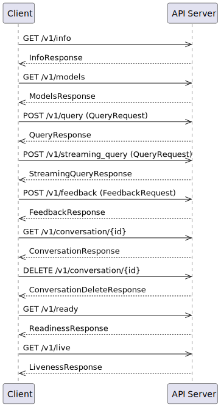
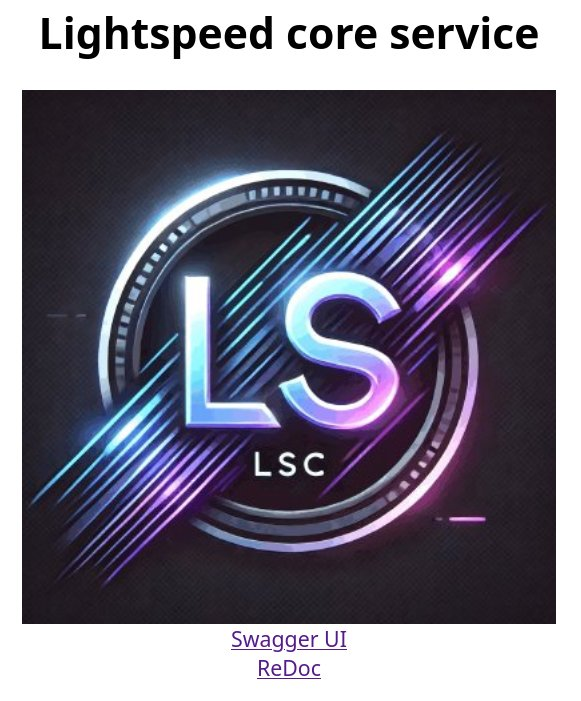
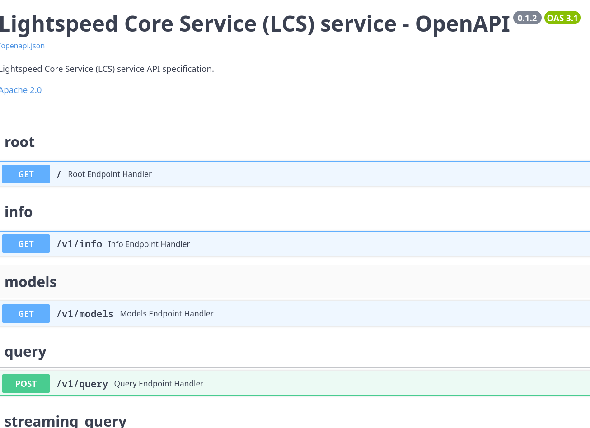
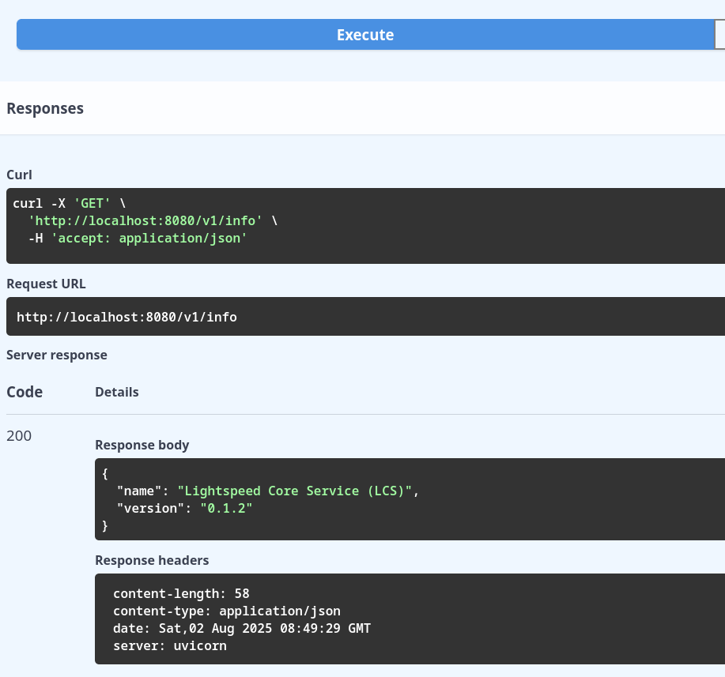

# Deployment Guide

<!-- vim-markdown-toc GFM -->

* [Preface](#preface)
* [Deployment methods](#deployment-methods)
* [Integration with Llama Stack framework](#integration-with-llama-stack-framework)
    * [Llama Stack as a library](#llama-stack-as-a-library)
    * [Llama Stack as a server](#llama-stack-as-a-server)
* [Local deployment](#local-deployment)
    * [Llama Stack used as a separate process](#llama-stack-used-as-a-separate-process)
        * [Prerequisites](#prerequisites)
        * [Installation of all required tools](#installation-of-all-required-tools)
        * [Installing dependencies for Llama Stack](#installing-dependencies-for-llama-stack)
        * [Check if Llama Stack can be started](#check-if-llama-stack-can-be-started)
        * [Llama Stack configuration](#llama-stack-configuration)
        * [Run Llama Stack in a separate process](#run-llama-stack-in-a-separate-process)
        * [LCS configuration to connect to Llama Stack running in separate process](#lcs-configuration-to-connect-to-llama-stack-running-in-separate-process)
        * [Start LCS](#start-lcs)
        * [Check if service runs](#check-if-service-runs)
    * [Llama Stack used as a library](#llama-stack-used-as-a-library)
        * [Prerequisites](#prerequisites-1)
        * [Installation of all required tools](#installation-of-all-required-tools-1)
        * [Installing dependencies for Llama Stack](#installing-dependencies-for-llama-stack-1)
        * [Llama Stack configuration](#llama-stack-configuration-1)
        * [LCS configuration to use Llama Stack in library mode](#lcs-configuration-to-use-llama-stack-in-library-mode)
        * [Start LCS](#start-lcs-1)
        * [Check if service runs](#check-if-service-runs-1)
* [Running from container](#running-from-container)
    * [Retrieving *Lightspeed Core Stack* image](#retrieving-lightspeed-core-stack-image)
        * [Prerequisites](#prerequisites-2)
        * [Retrieve the image](#retrieve-the-image)
    * [Llama Stack used as a separate process](#llama-stack-used-as-a-separate-process-1)
        * [Prerequisites](#prerequisites-3)
        * [Installation of all required tools](#installation-of-all-required-tools-2)
        * [Installing dependencies for Llama Stack](#installing-dependencies-for-llama-stack-2)
        * [Check if Llama Stack can be started](#check-if-llama-stack-can-be-started-1)
        * [Llama Stack configuration](#llama-stack-configuration-2)
        * [Run Llama Stack in a separate process](#run-llama-stack-in-a-separate-process-1)
        * [*Lightspeed Core Stack* configuration to connect to Llama Stack running in separate process](#lightspeed-core-stack-configuration-to-connect-to-llama-stack-running-in-separate-process)
        * [Start *Lightspeed Core Stack* from within a container](#start-lightspeed-core-stack-from-within-a-container)
    * [Llama Stack used as a library](#llama-stack-used-as-a-library-1)
        * [OpenAI key](#openai-key)
        * [Llama Stack configuration](#llama-stack-configuration-3)
    * [LCS configuration](#lcs-configuration)
    * [Start *Lightspeed Core Service* from a container](#start-lightspeed-core-service-from-a-container)
* [Usage](#usage)
    * [Using OpenAPI Swagger UI](#using-openapi-swagger-ui)
        * [Front page](#front-page)
        * [Swagger UI](#swagger-ui)
        * [Sending query to LLM](#sending-query-to-llm)
    * [Using `curl`](#using-curl)
        * [Accessing `info` REST API endpoint](#accessing-info-rest-api-endpoint)
        * [Retrieving list of available models](#retrieving-list-of-available-models)
        * [Retrieving LLM response](#retrieving-llm-response)

<!-- vim-markdown-toc -->


## Preface

In this document, you will learn how to install and run a service called *Lightspeed Core Stack (LCS)*. It is a service that allows users to communicate with large language models (LLMs), access to RAG databases, call so called agents, process conversation history, ensure that the conversation is only about permitted topics, etc.


## Deployment methods

*Lightspeed Core Stack (LCS)* is built on the Llama Stack framework, which can be run in several modes. Additionally, it is possible to run *LCS* locally (as a regular Python application) or from within a container. This means that it is possible to leverage multiple deployment methods:

- Local deployment
    - Llama Stack framework is used as a library
    - Llama Stack framework is used as a separate process (deployed locally)
- Running from a container
    - Llama Stack framework is used as a library
    - Llama Stack framework is used as a separate process

All those deployments methods will be covered later.


## Integration with Llama Stack framework

The Llama Stack framework can be run as a standalone server and accessed via its the REST API. However, instead of direct communication via the REST API (and JSON format), there is an even better alternative. It is based on the so-called Llama Stack Client. It is a library available for Python, Swift, Node.js or Kotlin, which "wraps" the REST API stack in a suitable way, which is easier for many applications.


### Llama Stack as a library

When this mode is selected, Llama Stack is used as a regular Python library. This means that the library must be installed in the system Python environment, a user-level environment, or a virtual environment. All calls to Llama Stack are performed via standard function or method calls:


> [!NOTE]
> Even when Llama Stack is used as a library, it still requires the configuration file `run.yaml` to be presented. This configuration file is loaded during initialization phase.


### Llama Stack as a server

When this mode is selected, Llama Stack is started as a separate REST API service. All communication with Llama Stack is performed via REST API calls, which means that Llama Stack can run on a separate machine if needed.


> [!NOTE]
> The REST API schema and semantics can change at any time, especially before version 1.0.0 is released. By using *Lightspeed Core Service*, developers, users, and customers stay isolated from these incompatibilities.


## Local deployment

In this chapter it will be shown how to run LCS locally. This mode is especially useful for developers, as it is possible to work with the latest versions of source codes, including locally made changes and improvements. And last but not least, it is possible to trace, monitor and debug the entire system from within integrated development environment etc.


### Llama Stack used as a separate process

The easiest option is to run Llama Stack in a separate process. This means that there will at least be two running processes involved:

1. Llama Stack framework with open port 8321 (can be easily changed if needed)
1. LCS with open port 8080 (can be easily changed if needed)


#### Prerequisites

1. Python 3.12 or 3.13
1. `pip` tool installed
1. `jq` and `curl` tools installed

#### Installation of all required tools

1. `pip install --user uv`
1. `sudo dnf install curl jq`

#### Installing dependencies for Llama Stack


1. Create a new directory outside of the lightspeed-stack project directory
    ```bash
    mkdir /tmp/llama-stack-server
    ```
1. Copy the project file named `pyproject.llamastack.toml` into the new directory, renaming it to `pyproject.toml':
    ```bash
    cp examples/pyproject.llamastack.toml /tmp/llama-stack-server/pyproject.toml
    ```

1. Run the following command to install all llama-stack dependencies in a new venv located in your new directory:

    ```bash
    cd /tmp/llama-stack-server
    uv sync
    ```

    You should get the following output:

    ```ascii
    Using CPython 3.12.10 interpreter at: /usr/bin/python3
    Creating virtual environment at: .venv
    Resolved 136 packages in 1.90s
          Built sqlalchemy==2.0.42
    Prepared 14 packages in 10.04s
    Installed 133 packages in 4.36s
     + accelerate==1.9.0
     + aiohappyeyeballs==2.6.1
     ...
     ...
     ...
     + transformers==4.54.0
     + triton==3.3.1
     + trl==0.20.0
     + typing-extensions==4.14.1
     + typing-inspection==0.4.1
     + tzdata==2025.2
     + urllib3==2.5.0
     + uvicorn==0.35.0
     + wcwidth==0.2.13
     + wrapt==1.17.2
     + xxhash==3.5.0
     + yarl==1.20.1
     + zipp==3.23.0
    ```


#### Check if Llama Stack can be started

1. In the next step, we need to verify that it is possible to run a tool called `llama`. It was installed into a Python virtual environment and therefore we have to run it via `uv run` command:
    ```bash
     uv run llama
    ```
1. If the installation was successful, the following messages should be displayed on the terminal:
    ```
    usage: llama [-h] {model,stack,download,verify-download} ...

    Welcome to the Llama CLI

    options:
      -h, --help            show this help message and exit

    subcommands:
      {model,stack,download,verify-download}

      model                 Work with llama models
      stack                 Operations for the Llama Stack / Distributions
      download              Download a model from llama.meta.com or Hugging Face Hub
      verify-download       Verify integrity of downloaded model files
    ```
1. If we try to run the Llama Stack without configuring it, only the exception information is displayed (which is not very user-friendly):
    ```bash
    uv run llama stack run
    ```
    Output:
    ```
    INFO     2025-07-27 16:56:12,464 llama_stack.cli.stack.run:147 server: No image type or image name provided. Assuming environment packages.
    Traceback (most recent call last):
      File "/tmp/ramdisk/llama-stack-runner/.venv/bin/llama", line 10, in <module>
        sys.exit(main())
                 ^^^^^^
      File "/tmp/ramdisk/llama-stack-runner/.venv/lib64/python3.12/site-packages/llama_stack/cli/llama.py", line 53, in main
        parser.run(args)
      File "/tmp/ramdisk/llama-stack-runner/.venv/lib64/python3.12/site-packages/llama_stack/cli/llama.py", line 47, in run
        args.func(args)
      File "/tmp/ramdisk/llama-stack-runner/.venv/lib64/python3.12/site-packages/llama_stack/cli/stack/run.py", line 164, in _run_stack_run_cmd
        server_main(server_args)
      File "/tmp/ramdisk/llama-stack-runner/.venv/lib64/python3.12/site-packages/llama_stack/distribution/server/server.py", line 414, in main
        elif args.template:
             ^^^^^^^^^^^^^
    AttributeError: 'Namespace' object has no attribute 'template'
    ```


#### Llama Stack configuration

Llama Stack needs to be configured properly. For using the default runnable Llama Stack a file named `run.yaml` needs to be created.  Copy the example `examples/run.yaml` from the lightspeed-stack project directory into your llama-stack directory.

```bash
cp examples/run.yaml /tmp/llama-stack-server
```


#### Run Llama Stack in a separate process

1. Export OpenAI key by using the following command:
    ```bash
    export OPENAI_API_KEY="sk-foo-bar-baz"
    ```
1. Run the following command:
    ```bash
    uv run llama stack run run.yaml
    ```
1. Check the output on terminal, it should look like:
    ```
    INFO     2025-07-29 15:26:20,864 llama_stack.cli.stack.run:126 server: Using run configuration: run.yaml
    INFO     2025-07-29 15:26:20,877 llama_stack.cli.stack.run:147 server: No image type or image name provided. Assuming environment packages.
    INFO     2025-07-29 15:26:21,277 llama_stack.distribution.server.server:441 server: Using config file: run.yaml
    INFO     2025-07-29 15:26:21,279 llama_stack.distribution.server.server:443 server: Run configuration:
    INFO     2025-07-29 15:26:21,285 llama_stack.distribution.server.server:445 server: apis:
             - agents
             - datasetio
             - eval
             - inference
             - post_training
             - safety
             - scoring
             - telemetry
             - tool_runtime
             - vector_io
             benchmarks: []
             container_image: null
             datasets: []
             external_providers_dir: null
             image_name: minimal-viable-llama-stack-configuration
             inference_store:
               db_path: .llama/distributions/ollama/inference_store.db
               type: sqlite
             logging: null
             metadata_store:
               db_path: .llama/distributions/ollama/registry.db
               namespace: null
               type: sqlite
             models:
             - metadata: {}
               model_id: gpt-4-turbo
               model_type: !!python/object/apply:llama_stack.apis.models.models.ModelType
               - llm
               provider_id: openai
               provider_model_id: gpt-4-turbo
             providers:
               agents:
               - config:
                   persistence_store:
                     db_path: .llama/distributions/ollama/agents_store.db
                     namespace: null
                     type: sqlite
                   responses_store:
                     db_path: .llama/distributions/ollama/responses_store.db
                     type: sqlite
                 provider_id: meta-reference
                 provider_type: inline::meta-reference
               datasetio:
               - config:
                   kvstore:
                     db_path: .llama/distributions/ollama/huggingface_datasetio.db
                     namespace: null
                     type: sqlite
                 provider_id: huggingface
                 provider_type: remote::huggingface
               - config:
                   kvstore:
                     db_path: .llama/distributions/ollama/localfs_datasetio.db
                     namespace: null
                     type: sqlite
                 provider_id: localfs
                 provider_type: inline::localfs
               eval:
               - config:
                   kvstore:
                     db_path: .llama/distributions/ollama/meta_reference_eval.db
                     namespace: null
                     type: sqlite
                 provider_id: meta-reference
                 provider_type: inline::meta-reference
               inference:
               - config:
                   api_key: '********'
                 provider_id: openai
                 provider_type: remote::openai
               post_training:
               - config:
                   checkpoint_format: huggingface
                   device: cpu
                   distributed_backend: null
                 provider_id: huggingface
                 provider_type: inline::huggingface
               safety:
               - config:
                   excluded_categories: []
                 provider_id: llama-guard
                 provider_type: inline::llama-guard
               scoring:
               - config: {}
                 provider_id: basic
                 provider_type: inline::basic
               - config: {}
                 provider_id: llm-as-judge
                 provider_type: inline::llm-as-judge
               - config:
                   openai_api_key: '********'
                 provider_id: braintrust
                 provider_type: inline::braintrust
               telemetry:
               - config:
                   service_name: lightspeed-stack
                   sinks: sqlite
                   sqlite_db_path: .llama/distributions/ollama/trace_store.db
                 provider_id: meta-reference
                 provider_type: inline::meta-reference
               tool_runtime:
               - config: {}
                 provider_id: model-context-protocol
                 provider_type: remote::model-context-protocol
               vector_io:
               - config:
                   kvstore:
                     db_path: .llama/distributions/ollama/faiss_store.db
                     namespace: null
                     type: sqlite
                 provider_id: faiss
                 provider_type: inline::faiss
             scoring_fns: []
             server:
               auth: null
               host: null
               port: 8321
               quota: null
               tls_cafile: null
               tls_certfile: null
               tls_keyfile: null
             shields: []
             tool_groups: []
             vector_dbs: []
             version: 2
    ```
1. The server with Llama Stack listens on port 8321. A description of the REST API is available in the form of OpenAPI (endpoint /openapi.json), but other endpoints can also be used. It is possible to check if Llama Stack runs as REST API server by retrieving its version. We use `curl` and `jq` tools for this purposes:
    ```bash
    curl localhost:8321/v1/version | jq .
    ```
    The output should be in this form:
    ```json
    {
      "version": "0.2.14"
    }
    ```


#### LCS configuration to connect to Llama Stack running in separate process

Copy the `examples/lightspeed-stack-lls-external.yaml` file to your llama-stack project directory, naming it `lightspeed-stack.yaml`:

```bash
cp examples/lightspeed-stack-lls-external.yaml lightspeed-stack.yaml`
```


#### Start LCS

```bash
make run
```

```
uv run src/lightspeed_stack.py
[07/29/25 15:43:35] INFO     Initializing app                                                                                 main.py:19
                    INFO     Including routers                                                                                main.py:68
INFO:     Started server process [1922983]
INFO:     Waiting for application startup.
                    INFO     Registering MCP servers                                                                          main.py:81
                    DEBUG    No MCP servers configured, skipping registration                                               common.py:36
                    INFO     Setting up model metrics                                                                         main.py:84
[07/29/25 15:43:35] DEBUG    Set provider/model configuration for openai/gpt-4-turbo to 0                                    utils.py:45
                    INFO     App startup complete                                                                             main.py:86
INFO:     Application startup complete.
INFO:     Uvicorn running on http://localhost:8080 (Press CTRL+C to quit)
```

#### Check if service runs

```bash
curl localhost:8080/v1/models | jq .
```

```json
{
  "models": [
    {
      "identifier": "gpt-4-turbo",
      "metadata": {},
      "api_model_type": "llm",
      "provider_id": "openai",
      "type": "model",
      "provider_resource_id": "gpt-4-turbo",
      "model_type": "llm"
    }
  ]
}
```


### Llama Stack used as a library

It is possible to run Lightspeed Core Stack service with Llama Stack "embedded" as a Python library. This means that just one process will be running and only one port (for example 8080) will be accessible.


#### Prerequisites

1. Python 3.12 or 3.13
1. `pip` tool installed
1. `jq` and `curl` tools installed

#### Installation of all required tools

1. `pip install --user uv`
1. `sudo dnf install curl jq`

#### Installing dependencies for Llama Stack

1. Clone LCS repository
1. Add and install all required dependencies
    ```bash
    uv sync --group llslibdev
    ```

#### Llama Stack configuration

Llama Stack needs to be configured properly. Copy the example config from examples/run.yaml to the project directory:

```bash
cp examples/run.yaml .
```


#### LCS configuration to use Llama Stack in library mode
Copy the example LCS config file from examples/lightspeed-stack-library.yaml to the project directory:

```bash
cp examples/lightspeed-stack-lls-library.yaml lightspeed-stack.yaml
```


#### Start LCS

1. Export OpenAI key by using the following command:
    ```bash
    export OPENAI_API_KEY="sk-foo-bar-baz"
    ```
1. Run the following command
    ```bash
    make run
    ```
1. Check the output
    ```text
    uv run src/lightspeed_stack.py
    Using config run.yaml:
    apis:
    - agents
    - datasetio
    - eval
    - inference
    - post_training
    - safety
    - scoring
    - telemetry
    - tool_runtime
    - vector_io
    [07/30/25 20:01:53] INFO     Initializing app                                                                                 main.py:19
    [07/30/25 20:01:54] INFO     Including routers                                                                                main.py:68
                        INFO     Registering MCP servers                                                                          main.py:81
                        DEBUG    No MCP servers configured, skipping registration                                               common.py:36
                        INFO     Setting up model metrics                                                                         main.py:84
    [07/30/25 20:01:54] DEBUG    Set provider/model configuration for openai/openai/chatgpt-4o-latest to 0                       utils.py:45
                        DEBUG    Set provider/model configuration for openai/openai/gpt-3.5-turbo to 0                           utils.py:45
                        DEBUG    Set provider/model configuration for openai/openai/gpt-3.5-turbo-0125 to 0                      utils.py:45
                        DEBUG    Set provider/model configuration for openai/openai/gpt-3.5-turbo-instruct to 0                  utils.py:45
                        DEBUG    Set provider/model configuration for openai/openai/gpt-4 to 0                                   utils.py:45
                        DEBUG    Set provider/model configuration for openai/openai/gpt-4-turbo to 0                             utils.py:45
                        DEBUG    Set provider/model configuration for openai/openai/gpt-4o to 0                                  utils.py:45
                        DEBUG    Set provider/model configuration for openai/openai/gpt-4o-2024-08-06 to 0                       utils.py:45
                        DEBUG    Set provider/model configuration for openai/openai/gpt-4o-audio-preview to 0                    utils.py:45
                        DEBUG    Set provider/model configuration for openai/openai/gpt-4o-mini to 0                             utils.py:45
                        DEBUG    Set provider/model configuration for openai/openai/o1 to 0                                      utils.py:45
                        DEBUG    Set provider/model configuration for openai/openai/o1-mini to 0                                 utils.py:45
                        DEBUG    Set provider/model configuration for openai/openai/o3-mini to 0                                 utils.py:45
                        DEBUG    Set provider/model configuration for openai/openai/o4-mini to 0                                 utils.py:45
                        DEBUG    Set provider/model configuration for openai/openai/text-embedding-3-large to 0                  utils.py:45
                        DEBUG    Set provider/model configuration for openai/openai/text-embedding-3-small to 0                  utils.py:45
                        INFO     App startup complete                                                                             main.py:86
    ```

#### Check if service runs

```bash
curl localhost:8080/v1/models | jq .
```

```json
{
  "models": [
    {
      "identifier": "gpt-4-turbo",
      "metadata": {},
      "api_model_type": "llm",
      "provider_id": "openai",
      "type": "model",
      "provider_resource_id": "gpt-4-turbo",
      "model_type": "llm"
    }
  ]
}
```


## Running from container

The image with *Lightspeed Core Stack* allow users to run the service in two modes. In the first mode, the *Llama Stack* runs in separate process - in a container or as a local or remote process. *Llama Stack* functions are accessible via exposed TCP port. In the second model, the Llama Stack is used as a standard Python library which means, that only the *Lightspeed Core Stack* image is needed and no other packages nor tools need to be installed.


### Retrieving *Lightspeed Core Stack* image

First, it is needed to get an image containing the *Lightspeed Core Stack* service and all the necessary libraries on which the service depends. It is possible to use the stable release version (like 1.0.0, or "latest" stable), latest development version, or development version identified by a date + SHA (that image is built for any merged pull request).


#### Prerequisites

- `podman` installed and configured properly

> [!NOTE]
> It is possible to use `docker` instead of `podman`, but this use case is not tested and thus not supported.


#### Retrieve the image

Stable release images are tagged with versions like `0.1.0`. Tag `latest` always points to the latest stable release.

Development images are build from main branch every time a new pull request is merged. Image tags for dev images use
the template `dev-YYYYMMMDDD-SHORT_SHA` e.g. `dev-20250704-eaa27fb`.

Tag `dev-latest` always points to the latest dev image built from latest git.

To retrieve the latest dev image, use the following command:

```bash
podman pull quay.io/lightspeed-core/lightspeed-stack:dev-latest
```

It should get the image, copy all layers, and write manifest:

```text
Trying to pull quay.io/lightspeed-core/lightspeed-stack:dev-latest...
Getting image source signatures
Copying blob 455d71b0a12b done   | 
Copying blob d8e516fe2a03 done   | 
Copying blob a299c213c55c done   | 
Copying config 4468f47593 done   | 
Writing manifest to image destination
4468f475931a54ad1e5c26270ff4c3e55ec31444c1b0bf8fb77a576db7ab33f1
```

To retrieve stable version `0.2.0`, use the following command:

```bash
podman pull quay.io/lightspeed-core/lightspeed-stack:0.2.0
```

```text
Trying to pull quay.io/lightspeed-core/lightspeed-stack:0.2.0...
Getting image source signatures
Copying blob 7c9e86f872c9 done   | 
Copying blob 455d71b0a12b skipped: already exists  
Copying blob a299c213c55c skipped: already exists  
Copying config a4982f4319 done   | 
Writing manifest to image destination
a4982f43195537b9eb1cec510fe6655f245d6d4b7236a4759808115d5d719972
```


### Llama Stack used as a separate process

*Lightspeed Core Stack* image can run LCS service that connects to Llama Stack running in a separate process. This means that there will at least be two running processes involved:

1. Llama Stack framework with open port 8321 (can be easily changed if needed)
1. Image with LCS (running in a container) with open port 8080 mapped to local port 8080 (can be easily changed if needed)


> [!NOTE]
> Please note that LCS service will be run in a container. Llama Stack itself can be run in a container, in separate local process, or on external machine. It is just needed to know the URL (including TCP port) to connect to Llama Stack.
> [!INFO]
> If Llama Stack is started from a container or is running on separate machine, you can skip next parts - it is expected that everything is setup accordingly.


#### Prerequisites

1. Python 3.12 or 3.13
1. `pip` tool installed
1. `jq` and `curl` tools installed

#### Installation of all required tools

1. `pip install --user uv`
1. `sudo dnf install curl jq`

#### Installing dependencies for Llama Stack


1. Create a new directory
    ```bash
    mkdir llama-stack-server
    cd llama-stack-server
    ```
1. Create project file named `pyproject.toml` in this directory. This file should have the following content:
    ```toml
    [project]
    name = "llama-stack-demo"
    version = "0.1.0"
    description = "Default template for PDM package"
    authors = []
    dependencies = [
        "llama-stack==0.2.14",
        "fastapi>=0.115.12",
        "opentelemetry-sdk>=1.34.0",
        "opentelemetry-exporter-otlp>=1.34.0",
        "opentelemetry-instrumentation>=0.55b0",
        "aiosqlite>=0.21.0",
        "litellm>=1.72.1",
        "uvicorn>=0.34.3",
        "blobfile>=3.0.0",
        "datasets>=3.6.0",
        "sqlalchemy>=2.0.41",
        "faiss-cpu>=1.11.0",
        "mcp>=1.9.4",
        "autoevals>=0.0.129",
        "psutil>=7.0.0",
        "torch>=2.7.1",
        "peft>=0.15.2",
        "trl>=0.18.2"]
    requires-python = "==3.12.*"
    readme = "README.md"
    license = {text = "MIT"}


    [tool.pdm]
    distribution = false
    ```
1. Run the following command to install all dependencies:

    ```bash
    uv sync
    ```

    You should get the following output:

    ```ascii
    Using CPython 3.12.10 interpreter at: /usr/bin/python3
    Creating virtual environment at: .venv
    Resolved 136 packages in 1.90s
          Built sqlalchemy==2.0.42
    Prepared 14 packages in 10.04s
    Installed 133 packages in 4.36s
     + accelerate==1.9.0
     + aiohappyeyeballs==2.6.1
     ...
     ...
     ...
     + transformers==4.54.0
     + triton==3.3.1
     + trl==0.20.0
     + typing-extensions==4.14.1
     + typing-inspection==0.4.1
     + tzdata==2025.2
     + urllib3==2.5.0
     + uvicorn==0.35.0
     + wcwidth==0.2.13
     + wrapt==1.17.2
     + xxhash==3.5.0
     + yarl==1.20.1
     + zipp==3.23.0
    ```


#### Check if Llama Stack can be started

1. In the next step, we need to verify that it is possible to run a tool called `llama`. It was installed into a Python virtual environment and therefore we have to run it via `uv run` command:
    ```bash
     uv run llama
    ```
1. If the installation was successful, the following messages should be displayed on the terminal:
    ```text
    usage: llama [-h] {model,stack,download,verify-download} ...

    Welcome to the Llama CLI

    options:
      -h, --help            show this help message and exit

    subcommands:
      {model,stack,download,verify-download}

      model                 Work with llama models
      stack                 Operations for the Llama Stack / Distributions
      download              Download a model from llama.meta.com or Hugging Face Hub
      verify-download       Verify integrity of downloaded model files
    ```
1. If we try to run the Llama Stack without configuring it, only the exception information is displayed (which is not very user-friendly):
    ```bash
    uv run llama stack run
    ```
    Output:
    ```
    INFO     2025-07-27 16:56:12,464 llama_stack.cli.stack.run:147 server: No image type or image name provided. Assuming environment packages.
    Traceback (most recent call last):
      File "/tmp/ramdisk/llama-stack-runner/.venv/bin/llama", line 10, in <module>
        sys.exit(main())
                 ^^^^^^
      File "/tmp/ramdisk/llama-stack-runner/.venv/lib64/python3.12/site-packages/llama_stack/cli/llama.py", line 53, in main
        parser.run(args)
      File "/tmp/ramdisk/llama-stack-runner/.venv/lib64/python3.12/site-packages/llama_stack/cli/llama.py", line 47, in run
        args.func(args)
      File "/tmp/ramdisk/llama-stack-runner/.venv/lib64/python3.12/site-packages/llama_stack/cli/stack/run.py", line 164, in _run_stack_run_cmd
        server_main(server_args)
      File "/tmp/ramdisk/llama-stack-runner/.venv/lib64/python3.12/site-packages/llama_stack/distribution/server/server.py", line 414, in main
        elif args.template:
             ^^^^^^^^^^^^^
    AttributeError: 'Namespace' object has no attribute 'template'
    ```


#### Llama Stack configuration

Llama Stack needs to be configured properly. For using the default runnable Llama Stack a file named `run.yaml` with following content needs to be created:

```yaml
version: '2'
image_name: minimal-viable-llama-stack-configuration

apis:
  - agents
  - datasetio
  - eval
  - inference
  - post_training
  - safety
  - scoring
  - telemetry
  - tool_runtime
  - vector_io
benchmarks: []
container_image: null
datasets: []
external_providers_dir: null
inference_store:
  db_path: .llama/distributions/ollama/inference_store.db
  type: sqlite
logging: null
metadata_store:
  db_path: .llama/distributions/ollama/registry.db
  namespace: null
  type: sqlite
providers:
  agents:
  - config:
      persistence_store:
        db_path: .llama/distributions/ollama/agents_store.db
        namespace: null
        type: sqlite
      responses_store:
        db_path: .llama/distributions/ollama/responses_store.db
        type: sqlite
    provider_id: meta-reference
    provider_type: inline::meta-reference
  datasetio:
  - config:
      kvstore:
        db_path: .llama/distributions/ollama/huggingface_datasetio.db
        namespace: null
        type: sqlite
    provider_id: huggingface
    provider_type: remote::huggingface
  - config:
      kvstore:
        db_path: .llama/distributions/ollama/localfs_datasetio.db
        namespace: null
        type: sqlite
    provider_id: localfs
    provider_type: inline::localfs
  eval:
  - config:
      kvstore:
        db_path: .llama/distributions/ollama/meta_reference_eval.db
        namespace: null
        type: sqlite
    provider_id: meta-reference
    provider_type: inline::meta-reference
  inference:
    - provider_id: openai
      provider_type: remote::openai
      config:
        api_key: ${env.OPENAI_API_KEY}
  post_training:
  - config:
      checkpoint_format: huggingface
      device: cpu
      distributed_backend: null
    provider_id: huggingface
    provider_type: inline::huggingface
  safety:
  - config:
      excluded_categories: []
    provider_id: llama-guard
    provider_type: inline::llama-guard
  scoring:
  - config: {}
    provider_id: basic
    provider_type: inline::basic
  - config: {}
    provider_id: llm-as-judge
    provider_type: inline::llm-as-judge
  - config:
      openai_api_key: '********'
    provider_id: braintrust
    provider_type: inline::braintrust
  telemetry:
  - config:
      service_name: 'lightspeed-stack'
      sinks: sqlite
      sqlite_db_path: .llama/distributions/ollama/trace_store.db
    provider_id: meta-reference
    provider_type: inline::meta-reference
  tool_runtime:
    - provider_id: model-context-protocol
      provider_type: remote::model-context-protocol
      config: {}
  vector_io:
  - config:
      kvstore:
        db_path: .llama/distributions/ollama/faiss_store.db
        namespace: null
        type: sqlite
    provider_id: faiss
    provider_type: inline::faiss
scoring_fns: []
server:
  auth: null
  host: null
  port: 8321
  quota: null
  tls_cafile: null
  tls_certfile: null
  tls_keyfile: null
shields: []
vector_dbs: []

models:
  - model_id: gpt-4-turbo
    provider_id: openai
    model_type: llm
    provider_model_id: gpt-4-turbo
```


#### Run Llama Stack in a separate process

1. Export OpenAI key by using the following command:
    ```bash
    export OPENAI_API_KEY="sk-foo-bar-baz"
    ```
1. Run the following command:
    ```bash
    uv run llama stack run run.yaml
    ```
1. Check the output on terminal, it should look like:
    ```text
    INFO     2025-07-29 15:26:20,864 llama_stack.cli.stack.run:126 server: Using run configuration: run.yaml
    INFO     2025-07-29 15:26:20,877 llama_stack.cli.stack.run:147 server: No image type or image name provided. Assuming environment packages.
    INFO     2025-07-29 15:26:21,277 llama_stack.distribution.server.server:441 server: Using config file: run.yaml
    INFO     2025-07-29 15:26:21,279 llama_stack.distribution.server.server:443 server: Run configuration:
    INFO     2025-07-29 15:26:21,285 llama_stack.distribution.server.server:445 server: apis:
             - agents
             - datasetio
             - eval
             - inference
             - post_training
             - safety
             - scoring
             - telemetry
             - tool_runtime
             - vector_io
             benchmarks: []
             container_image: null
             datasets: []
             external_providers_dir: null
             image_name: minimal-viable-llama-stack-configuration
             inference_store:
               db_path: .llama/distributions/ollama/inference_store.db
               type: sqlite
             logging: null
             metadata_store:
               db_path: .llama/distributions/ollama/registry.db
               namespace: null
               type: sqlite
             models:
             - metadata: {}
               model_id: gpt-4-turbo
               model_type: !!python/object/apply:llama_stack.apis.models.models.ModelType
               - llm
               provider_id: openai
               provider_model_id: gpt-4-turbo
             providers:
               agents:
               - config:
                   persistence_store:
                     db_path: .llama/distributions/ollama/agents_store.db
                     namespace: null
                     type: sqlite
                   responses_store:
                     db_path: .llama/distributions/ollama/responses_store.db
                     type: sqlite
                 provider_id: meta-reference
                 provider_type: inline::meta-reference
               datasetio:
               - config:
                   kvstore:
                     db_path: .llama/distributions/ollama/huggingface_datasetio.db
                     namespace: null
                     type: sqlite
                 provider_id: huggingface
                 provider_type: remote::huggingface
               - config:
                   kvstore:
                     db_path: .llama/distributions/ollama/localfs_datasetio.db
                     namespace: null
                     type: sqlite
                 provider_id: localfs
                 provider_type: inline::localfs
               eval:
               - config:
                   kvstore:
                     db_path: .llama/distributions/ollama/meta_reference_eval.db
                     namespace: null
                     type: sqlite
                 provider_id: meta-reference
                 provider_type: inline::meta-reference
               inference:
               - config:
                   api_key: '********'
                 provider_id: openai
                 provider_type: remote::openai
               post_training:
               - config:
                   checkpoint_format: huggingface
                   device: cpu
                   distributed_backend: null
                 provider_id: huggingface
                 provider_type: inline::huggingface
               safety:
               - config:
                   excluded_categories: []
                 provider_id: llama-guard
                 provider_type: inline::llama-guard
               scoring:
               - config: {}
                 provider_id: basic
                 provider_type: inline::basic
               - config: {}
                 provider_id: llm-as-judge
                 provider_type: inline::llm-as-judge
               - config:
                   openai_api_key: '********'
                 provider_id: braintrust
                 provider_type: inline::braintrust
               telemetry:
               - config:
                   service_name: lightspeed-stack
                   sinks: sqlite
                   sqlite_db_path: .llama/distributions/ollama/trace_store.db
                 provider_id: meta-reference
                 provider_type: inline::meta-reference
               tool_runtime:
               - config: {}
                 provider_id: model-context-protocol
                 provider_type: remote::model-context-protocol
               vector_io:
               - config:
                   kvstore:
                     db_path: .llama/distributions/ollama/faiss_store.db
                     namespace: null
                     type: sqlite
                 provider_id: faiss
                 provider_type: inline::faiss
             scoring_fns: []
             server:
               auth: null
               host: null
               port: 8321
               quota: null
               tls_cafile: null
               tls_certfile: null
               tls_keyfile: null
             shields: []
             tool_groups: []
             vector_dbs: []
             version: 2
    ```
1. The server with Llama Stack listens on port 8321. A description of the REST API is available in the form of OpenAPI (endpoint /openapi.json), but other endpoints can also be used. It is possible to check if Llama Stack runs as REST API server by retrieving its version. We use `curl` and `jq` tools for this purposes:
    ```bash
    curl localhost:8321/v1/version | jq .
    ```
    The output should be in this form:
    ```json
    {
      "version": "0.2.14"
    }
    ```


#### *Lightspeed Core Stack* configuration to connect to Llama Stack running in separate process

Image with *Lightspeed Core Stack* needs to be configured properly. Create local file named `lightspeed-stack.yaml` with the following content:

```yaml
name: Lightspeed Core Service (LCS)
service:
  host: localhost
  port: 8080
  auth_enabled: false
  workers: 1
  color_log: true
  access_log: true
llama_stack:
  use_as_library_client: false
  url: http://localhost:8321
  api_key: xyzzy
user_data_collection:
  feedback_enabled: true
  feedback_storage: "/tmp/data/feedback"
  transcripts_enabled: true
  transcripts_storage: "/tmp/data/transcripts"

authentication:
  module: "noop"
```


#### Start *Lightspeed Core Stack* from within a container

Now it is needed to run *Lightspeed Core Stack* from within a container. The service needs to be configured, so `lightspeed-stack.yaml` has to be mounted into the container:

```bash
podman run -it --network host -v lightspeed-stack.yaml:/app-root/lightspeed-stack.yaml:Z quay.io/lightspeed-core/lightspeed-stack:dev-latest
```

> [!NOTE]
> Please note that `--network host` is insecure option. It is used there because LCS service running in a container have to access Llama Stack running *outside* this container and the standard port mapping can not be leveraged there. This configuration would be ok for development purposes, but for real deployment, network needs to be reconfigured accordingly to maintain required container isolation!


### Llama Stack used as a library

Llama Stack can be used as a library that is already part of OLS image. It means that no other processed needs to be started, but more configuration is required. Everything will be started from within the one container:


#### OpenAI key

First, export your OpenAI key into environment variable:

```bash
export OPENAI_API_KEY="sk-foo-bar-baz-my-key"
```

#### Llama Stack configuration

Create a file named `run.yaml` with following content:

```yaml
version: '2'
image_name: minimal-viable-llama-stack-configuration

apis:
  - agents
  - datasetio
  - eval
  - inference
  - post_training
  - safety
  - scoring
  - telemetry
  - tool_runtime
  - vector_io
benchmarks: []
container_image: null
datasets: []
external_providers_dir: null
inference_store:
  db_path: .llama/distributions/ollama/inference_store.db
  type: sqlite
logging: null
metadata_store:
  db_path: .llama/distributions/ollama/registry.db
  namespace: null
  type: sqlite
providers:
  agents:
  - config:
      persistence_store:
        db_path: .llama/distributions/ollama/agents_store.db
        namespace: null
        type: sqlite
      responses_store:
        db_path: .llama/distributions/ollama/responses_store.db
        type: sqlite
    provider_id: meta-reference
    provider_type: inline::meta-reference
  datasetio:
  - config:
      kvstore:
        db_path: .llama/distributions/ollama/huggingface_datasetio.db
        namespace: null
        type: sqlite
    provider_id: huggingface
    provider_type: remote::huggingface
  - config:
      kvstore:
        db_path: .llama/distributions/ollama/localfs_datasetio.db
        namespace: null
        type: sqlite
    provider_id: localfs
    provider_type: inline::localfs
  eval:
  - config:
      kvstore:
        db_path: .llama/distributions/ollama/meta_reference_eval.db
        namespace: null
        type: sqlite
    provider_id: meta-reference
    provider_type: inline::meta-reference
  inference:
    - provider_id: openai
      provider_type: remote::openai
      config:
        api_key: ${env.OPENAI_API_KEY}
  post_training:
  - config:
      checkpoint_format: huggingface
      device: cpu
      distributed_backend: null
    provider_id: huggingface
    provider_type: inline::huggingface
  safety:
  - config:
      excluded_categories: []
    provider_id: llama-guard
    provider_type: inline::llama-guard
  scoring:
  - config: {}
    provider_id: basic
    provider_type: inline::basic
  - config: {}
    provider_id: llm-as-judge
    provider_type: inline::llm-as-judge
  - config:
      openai_api_key: '********'
    provider_id: braintrust
    provider_type: inline::braintrust
  telemetry:
```

### LCS configuration

Create file `lightspeed-stack.yaml` with the following content:

```yaml
name: Lightspeed Core Service (LCS)
service:
  host: localhost
  port: 8080
  auth_enabled: false
  workers: 1
  color_log: true
  access_log: true
llama_stack:
  use_as_library_client: true
  library_client_config_path: ./run.yaml
  api_key: xyzzy
user_data_collection:
  feedback_enabled: true
  feedback_storage: "/tmp/data/feedback"
  transcripts_enabled: true
  transcripts_storage: "/tmp/data/transcripts"

authentication:
  module: "noop"
```


### Start *Lightspeed Core Service* from a container

Now it is time to start the service from a container. It is needed to mount both configuration files `lightspeed-stack.yaml` and `run.yaml` into the container. And it is also needed to expose environment variable containing OpenAI key:

```bash
podman run -it -p 8080:8080 -v lightspeed-stack.yaml:/app-root/lightspeed-stack.yaml:Z -v ./run.yaml:/app-root/run.yaml:Z -e OPENAI_API_KEY=${OPENAI_API_KEY} quay.io/lightspeed-core/lightspeed-stack:dev-latest
```


## Usage

The *Lightspeed Core Stack* service exposes its own REST API endpoints:



### Using OpenAPI Swagger UI

#### Front page

Open <http://localhost:8080> URL in your web browser. The following front page should be displayed:



#### Swagger UI

Click on [Swagger UI](http://localhost:8080/docs) link to open Swagger UI page:



List of all available REST API endpoints is displayed on this page. It is possible to interactively access any endpoint, specify query parameters, JSON payload etc. For example it is possible to access [Info endpoint](http://localhost:8080/v1/info) and see actual response from the Lightspeed Core Stack service:




#### Sending query to LLM

Some REST API endpoints like `/query` requires payload to be send into the service. This payload should be represented in JSON format. Some attributes in JSON payload are optional, so it is possible to send just the question and system prompt. In this case the JSON payload should look like:


The response retrieved from LLM is displayed directly on Swagger UI page:


### Using `curl`

To access Lightspeed Core Stack service functions via REST API from command line, just the `curl` tool and optionally `jq` tool are needed. Any REST API endpoint can be accessed from command line.

#### Accessing `info` REST API endpoint

For example, the [/v1/info](http://localhost:8080/v1/info) endpoint can be accessed without parameters using `HTTP GET` method:

```bash
curl http://localhost:8080/v1/info | jq .
```

The response should look like:

```json
{
  "name": "Lightspeed Core Service (LCS)",
  "version": "0.2.0"
}
```

#### Retrieving list of available models

Use the [/v1/models](http://localhost:8080/v1/models) to get list of available models:

```bash
curl http://localhost:8080/v1/models | jq .
```

Please note that actual response from the service is larger. It was stripped down in this guide:

```json
{
  "models": [
    {
      "identifier": "gpt-4-turbo",
      "metadata": {},
      "api_model_type": "llm",
      "provider_id": "openai",
      "type": "model",
      "provider_resource_id": "gpt-4-turbo",
      "model_type": "llm"
    },
    {
      "identifier": "openai/gpt-4o-mini",
      "metadata": {},
      "api_model_type": "llm",
      "provider_id": "openai",
      "type": "model",
      "provider_resource_id": "gpt-4o-mini",
      "model_type": "llm"
    },
    {
      "identifier": "openai/gpt-4o-audio-preview",
      "metadata": {},
      "api_model_type": "llm",
      "provider_id": "openai",
      "type": "model",
      "provider_resource_id": "gpt-4o-audio-preview",
      "model_type": "llm"
    },
    {
      "identifier": "openai/chatgpt-4o-latest",
      "metadata": {},
      "api_model_type": "llm",
      "provider_id": "openai",
      "type": "model",
      "provider_resource_id": "chatgpt-4o-latest",
      "model_type": "llm"
    },
    {
      "identifier": "openai/o1",
      "metadata": {},
      "api_model_type": "llm",
      "provider_id": "openai",
      "type": "model",
      "provider_resource_id": "o1",
      "model_type": "llm"
    },
    {
      "identifier": "openai/text-embedding-3-small",
      "metadata": {
        "embedding_dimension": 1536.0,
        "context_length": 8192.0
      },
      "api_model_type": "llm",
      "provider_id": "openai",
      "type": "model",
      "provider_resource_id": "text-embedding-3-small",
      "model_type": "llm"
    },
    {
      "identifier": "openai/text-embedding-3-large",
      "metadata": {
        "embedding_dimension": 3072.0,
        "context_length": 8192.0
      },
      "api_model_type": "llm",
      "provider_id": "openai",
      "type": "model",
      "provider_resource_id": "text-embedding-3-large",
      "model_type": "llm"
    }
  ]
}
```

#### Retrieving LLM response

To retrieve LLM response, the question (or query) needs to be send to inference model. Thus the `HTTP POST` method should be used:

```bash
$ curl -X 'POST' \
>   'http://localhost:8080/v1/query' \
>   -H 'accept: application/json' \
>   -H 'Content-Type: application/json' \
>   -d '{
>   "query": "write a deployment yaml for the mongodb image",
>   "system_prompt": "You are a helpful assistant"
> }'
```

Response should look like:

```json
{
  "conversation_id": "a731eaf2-0935-47ee-9661-2e9b36cda1f4",
  "response": "Below is a basic example of a Kubernetes deployment YAML file for deploying a MongoDB instance using the official MongoDB Docker image. This YAML file defines a Deployment resource that manages a Pod with a single MongoDB container.\n\n```yaml\napiVersion: apps/v1\nkind: Deployment\nmetadata:\n  name: mongodb-deployment\n  labels:\n    app: mongodb\nspec:\n  replicas: 1\n  selector:\n    matchLabels:\n      app: mongodb\n  template:\n    metadata:\n      labels:\n        app: mongodb\n    spec:\n      containers:\n      - name: mongodb\n        image: mongo:latest\n        ports:\n        - containerPort: 27017\n        env:\n        - name: MONGO_INITDB_ROOT_USERNAME\n          value: \"mongoadmin\"\n        - name: MONGO_INITDB_ROOT_PASSWORD\n          value: \"mongopass\"\n        volumeMounts:\n        - name: mongodb-data\n          mountPath: /data/db\n      volumes:\n      - name: mongodb-data\n        persistentVolumeClaim:\n          claimName: mongodb-pvc\n---\napiVersion: v1\nkind: Service\nmetadata:\n  name: mongodb-service\nspec:\n  ports:\n  - port: 27017\n    targetPort: 27017\n  selector:\n    app: mongodb\n  type: ClusterIP\n---\napiVersion: v1\nkind: PersistentVolumeClaim\nmetadata:\n  name: mongodb-pvc\nspec:\n  accessModes:\n    - ReadWriteOnce\n  resources:\n    requests:\n      storage: 1Gi\n```\n\n### Explanation of the YAML Components:\n\n1. **Deployment**:\n   - `apiVersion: apps/v1`: Specifies the API version for the Deployment.\n   - `kind: Deployment`: Specifies that this is a Deployment resource.\n   - `metadata`: Metadata about the deployment, such as its name.\n   - `spec`: Specification of the deployment.\n     - `replicas`: Number of desired pods.\n     - `selector`: Selector for pod targeting.\n     - `template`: Template for the pod.\n       - `containers`: List of containers within the pod.\n         - `image`: Docker image of MongoDB.\n         - `ports`: Container port MongoDB server listens on.\n         - `env`: Environment variables for MongoDB credentials.\n         - `volumeMounts`: Mount points for volumes inside the container.\n\n2. **Service**:\n   - `apiVersion: v1`: Specifies the API version for the Service.\n   - `kind: Service`: Specifies that this is a Service resource.\n   - `metadata`: Metadata about the service, such as its name.\n   - `spec`: Specification of the service.\n     - `ports`: Ports the service exposes.\n     - `selector`: Selector for service targeting.\n     - `type`: Type of service, `ClusterIP` for internal access.\n\n3. **PersistentVolumeClaim (PVC)**:\n   - `apiVersion: v1`: Specifies the API version for the PVC.\n   - `kind: PersistentVolumeClaim`: Specifies that this is a PVC resource.\n   - `metadata`: Metadata about the PVC, such as its name.\n   - `spec`: Specification of the PVC.\n     - `accessModes`: Access modes for the volume.\n     - `resources`: Resources requests for the volume.\n\nThis setup ensures that MongoDB data persists across pod restarts and provides a basic internal service for accessing MongoDB within the cluster. Adjust the storage size, MongoDB version, and credentials as necessary for your specific requirements."
}
```

> [!NOTE]
> As is shown on the previous example, the output might contain endlines, Markdown marks etc.
